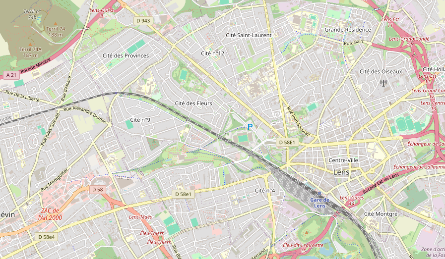
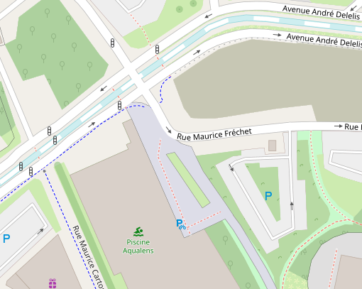
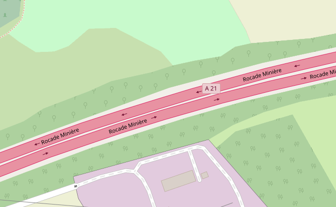
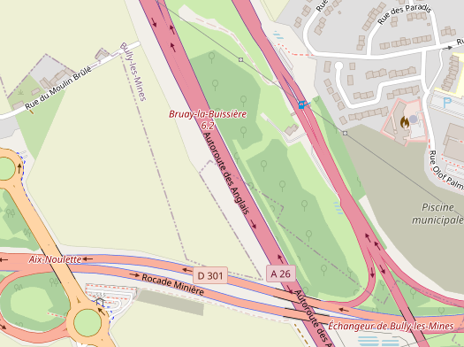
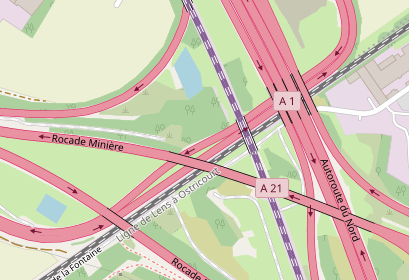

# OSM Cavi

OSM Cavi is a CartoCSS map style derived from [OSM Carto](https://github.com/gravitystorm/openstreetmap-carto).

This style was mostly made for fun, and aims to improve and extend the original OSM Carto style over minor but important details.

## Changes

- Light yellow for tertiary roads
- Busway rendering
- Shrubbery rendering

- Slightly darker green for meadows

- Unpaved filter for turning circles
- Blue road casing for motorroads and purple for tolled roads (dark pink for combined)

- Dark purple for high-speed rail

This style is still in very early devloppement and will change a lot over time!

## Planned

- Pedestrian crossing rendering
- Slightly different colors based on building types
- More style/color changes from the original style
